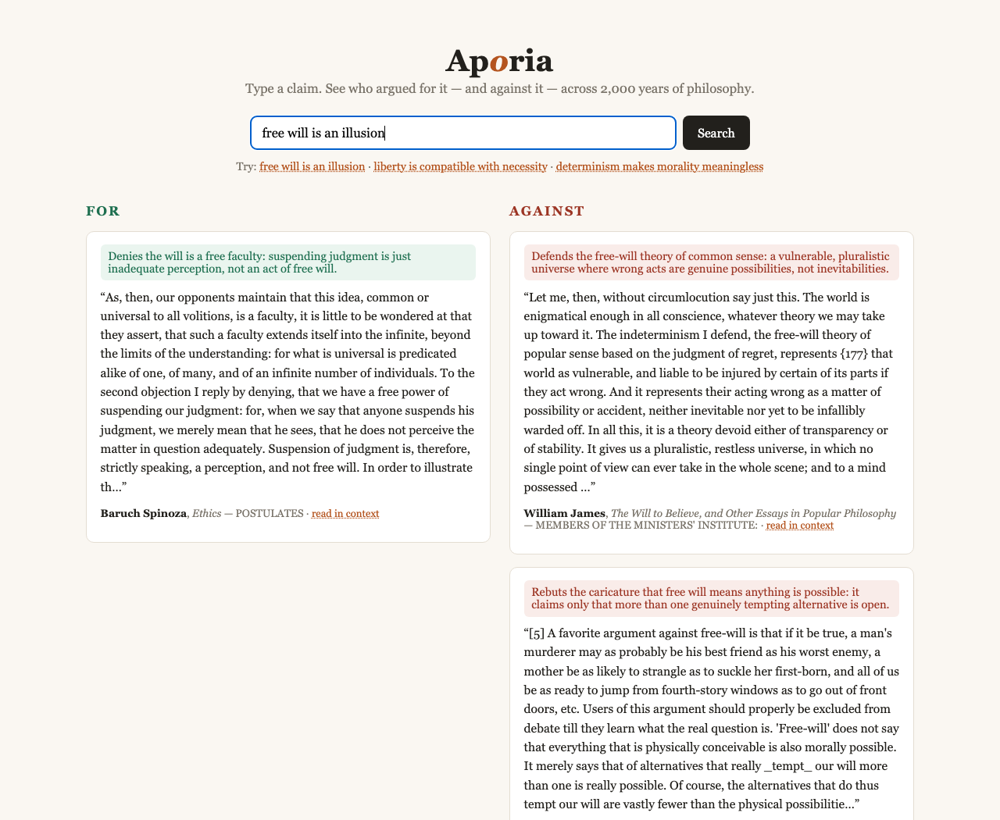

# Aporia

[](https://github.com/SrikarChittemsetty/aporia/actions/workflows/ci.yml)

**Search 2,000 years of philosophy by argument, not keyword.**

Type a claim — *"free will is an illusion"* — or just a topic — *"free
will"*, *"evil"*, *"existence of god"* — and get the actual primary-source
passages where philosophers argued **for** and **against** it, with citations
and a one-line summary of the move each passage makes. Bare topics are
resolved to the canonical contested claim first (*"existence of god"* →
*"God exists"*), so the FOR/AGAINST split always has a definite thesis.

### **[▶ Try it — twelve debates, no install](https://srikarchittemsetty.github.io/aporia/)**

Pick a claim and watch Kant and Spinoza land on opposite sides of it. That page
is a frozen snapshot of real pipeline output; the sections below are how it was
built.

| | |
|---|---|
| Corpus | **3,723 passages** from 13 primary works, 10 philosophers |
| Vector index | **written from scratch in NumPy** from the HNSW paper — 0.999 recall@10, 0.46 ms p50 |
| Retrieval eval | **20 of 21 held-out** claims surface the philosopher who actually holds the position (95.2%); plain dense retrieval alone scores 19/21 |
| Stance layer | one Claude call per claim, cached forever |
| Classifier reliability | **88.9%** run-to-run agreement over 144 passages — and **0** for↔against reversals |
| Tests | 17 pytest tests, green in CI |



*Above: Spinoza and Nietzsche land on FOR, James and Kant on AGAINST —
retrieved from the original texts, classified by stance, cited to the
section.*

## Why this is hard

Ordinary semantic search finds passages *about* a topic. It cannot tell a
defense of free will from an attack on it — both are topically identical and
embed near each other. Aporia layers **stance-aware retrieval** on top of
vector search: every retrieved passage is classified relative to *your claim*
(for / against / nuance) by an LLM, with results cached so each unique claim
is classified exactly once. Full design rationale: [docs/DESIGN.md](docs/DESIGN.md).

```
OFFLINE   Gutenberg texts → clean → chunk (~100–300 words, citation metadata)
          → embed (bge-small) → hnswlib index
ONLINE    claim → expand to a hypothetical period passage (cached) → blend
          vectors → top-K vector search → one batched Claude call classifies
          stance + move per passage (cached) → FOR/AGAINST → UI
```

## Try it in two minutes

```bash
git clone https://github.com/SrikarChittemsetty/aporia && cd aporia
python3.12 -m venv .venv && source .venv/bin/activate
pip install -r requirements.txt

python -m ingest.download && python -m ingest.chunk && python -m index.build_index
uvicorn api.main:app --port 8080
# open http://localhost:8080 and click an example query
```

The example queries on the landing page ship with pre-cached stance
classifications, so the demo works immediately — no API key needed. Novel
claims use Claude for classification: set `ANTHROPIC_API_KEY` (or be logged
into the `claude` CLI). Without either, novel queries still return passages,
just ungrouped.

Searches are shareable links: `/?q=liberty+is+compatible+with+necessity`.

## What's under the hood

- **`ingest/`** — Project Gutenberg download + cleaning, paragraph-merging
  chunker that preserves author/work/section/char-offset metadata (powers the
  "read in context" expansion).
- **`index/`** — `sentence-transformers` embeddings behind a swappable
  [`VectorIndex`](index/vector_index.py) interface with three interchangeable
  implementations: exact brute force (NumPy), hnswlib, and
  [**a from-scratch HNSW written in pure NumPy**](index/pyhnsw.py) —
  hierarchical proximity graphs, beam search, and the Malkov–Yashunin
  neighbor-selection heuristic implemented from the paper. **The demo serves
  the from-scratch index** (`INDEX_KIND` in config.py switches back to
  hnswlib or exact search). Benchmarks below.
- **`api/`** — FastAPI. `/search` does claim resolution, retrieval, and
  stance grouping; `/passage/{id}` returns a chunk with its neighbors. Topic
  queries resolve via a built-in claim table, then a cached LLM call
  ([api/claims.py](api/claims.py)). The stance layer
  ([api/stance.py](api/stance.py)) batches all passages into one Claude call,
  caches per (claim, passage) in SQLite, and degrades gracefully (unclassified
  results, never cached) if no LLM backend is reachable.
- **`evals/`** — retrieval suite: 41 hand-written claims with the authors who
  actually argue them, three or four per work, plus a **21-query held-out set**
  written after the fact. Plain dense retrieval scores 37/41 and 19/21; with
  query expansion, 41/41 and **20/21**. See the failure mode it exposed and the
  fix, below.
- **`api/expand.py`** — query expansion (HyDE): searches with a blend of the
  user's claim and a hypothetical period passage arguing it, cached per claim.
- **`scripts/export_site.py`** — freezes a curated set of claims into the
  static site at [`docs/`](docs/) that backs the live demo link above. It runs
  the real retrieval path, emits the pipeline's own classification prompt for
  any unclassified (claim, passage) pair, and folds the answers back into the
  same SQLite stance cache the app reads — so the demo is a snapshot of real
  output, and a local run of the app answers those twelve claims with no API
  key. Three stages: `retrieve`, `ingest`, `build`.

## Corpus (13 works, all public domain via Project Gutenberg)

Free will: Hume's *Enquiry*, Spinoza's *Ethics*, James's *The Will to
Believe*, Kant's two *Critiques*-era works. God and evil: Hume's *Dialogues
Concerning Natural Religion*, Descartes's *Discourse on the Method*.
Morality: Nietzsche's *Beyond Good and Evil*, Mill's *Utilitarianism*, Kant's
*Groundwork*. Rights and justice: Locke's *Second Treatise*, Mill's *On
Liberty*, Paine's *Rights of Man*, Plato's *Republic*. The full list with
Gutenberg IDs lives in [config.py](config.py) — adding a work is one dict
entry plus a pipeline re-run (chunking is incremental; existing chunk ids are
stable).

## What the bigger eval exposed

Widening the retrieval eval from 10 free-will queries to 41 across every work
barely moved the headline (9/10 → 37/41), which is the boring part. The
interesting part is the four misses, because they are all the same miss.

| query | wanted | got |
|---|---|---|
| "most people mistake shadows for reality" | Plato | Spinoza, Hume, Nietzsche, Descartes, James |
| "morality is an invention of the weak to constrain the strong" | Nietzsche | Kant, Mill |
| "good and evil are historical inventions rather than eternal facts" | Nietzsche | Spinoza, Hume, Kant, Plato, James |
| "we should reject any belief we can find the slightest reason to doubt" | Descartes | Hume, Kant, Mill, James |

Every one of those arguments *is* in the corpus. Re-running the same queries in
the text's own language finds them immediately:

| query | retrieves |
|---|---|
| "most people mistake shadows for reality" | ✗ no Plato |
| "prisoners chained in a cave see only shadows cast on the wall" | ✓ **Plato** |
| "morality is an invention of the weak to constrain the strong" | ✗ no Nietzsche |
| "master morality and slave morality are two distinct types" | ✓ **Nietzsche** |

So the failure mode is specific and diagnosable: **the embedding matches
vocabulary and imagery, not the conclusion an argument reaches.** Plato makes the
point about appearance and reality by telling a story about a den, prisoners and
firelight, and never states the moral in the abstract terms a user would type.
Nietzsche coins his own vocabulary rather than using the paraphrase everyone
remembers him by. Both are exactly the passages a philosophy search engine most
needs to find, and dense retrieval alone reliably misses them.

## Fixing it, and what the fix is actually worth

[`api/expand.py`](api/expand.py) closes the gap from the query side. Before
searching, it asks the model to write a short passage *as a philosopher arguing
the claim would have written it* — period vocabulary, period imagery — embeds
that, and searches with a blend of the two vectors. The hypothetical passage is
invented and is never shown to anyone; it exists only to move the query into the
region of the space where the real passages live. (This is the HyDE idea: a
hypothetical document makes a better search key than a question.) One cached
model call per unique claim, exactly like the stance layer, and it degrades to
plain vector search when no backend is reachable.

| | plain retrieval | with expansion | change |
|---|---|---|---|
| Development set (41 queries) | 37/41 — 90.2% | **41/41 — 100%** | +4 fixed, 0 broken |
| **Held-out set (21 queries)** | 19/21 — 90.5% | **20/21 — 95.2%** | +1 fixed, **0 broken** |

**The held-out row is the one that counts.** The 41-query set is where the
failure was *found*, so scoring 100% on it after fixing exactly those four
queries proves very little. [`evals/holdout.py`](evals/holdout.py) is twenty-one
queries written afterwards, never used to build or tune anything, and never
revised after seeing a result. The gain there is real but far more modest — and
the important column is the last one: at no blend strength on either set did
expansion break a query that previously worked.

The blend strength was chosen the same way. On held-out queries `alpha=0.3`
scores 20/21 while 0.5, 0.7 and 1.0 all score 19/21 — the same as no expansion
at all. The user's own wording carries most of the signal; the hypothetical is a
nudge, and turning it into a shove throws away what was actually asked. On the
development set 0.3, 0.5 and 0.7 all score 41/41, which is exactly the kind of
unanimity that makes a development set look more decisive than it is.

The one held-out query still missed — *"the mind and the body are entirely
different kinds of thing"*, which wants Descartes — is a genuine failure, not a
mislabelled expectation: the argument is in the corpus, in Part IV of the
*Discourse*.

```bash
python -m evals.expansion_eval            # the development set, all blend strengths
python -m evals.expansion_eval --holdout  # the set that counts
```

## Index benchmarks

`python -m evals.bench` — 100 held-out corpus vectors as queries, k=10,
recall measured against exact search:

| Index | recall@10 | build time | p50 query | p95 query |
|---|---|---|---|---|
| NumPy brute force (exact) | 1.000 | 0.0s | 0.18 ms | 0.27 ms |
| hnswlib (C++) | 0.996 | 0.3s | 0.20 ms | 0.26 ms |
| PyHNSW (ours, NumPy) | 0.999 | 18.3s | 0.46 ms | 0.58 ms |

*(3,623 vectors, dim 384, MacBook CPU.)*

Honest reading: at this corpus size a single vectorized matrix product is
hard to beat, and C++ beats Python on constant factors. That invites the
obvious question — so why build the index? — and
**[BENCHMARKS.md](BENCHMARKS.md) answers it by measuring the crossover** across
corpus sizes from 3.7k to 300k vectors:

| vectors | brute force | hnswlib | PyHNSW (ours) |
|--------:|------------:|--------:|--------------:|
| 3,723 *(today)* | 0.187 ms | 0.180 ms | 0.434 ms |
| 7,500 | 0.496 ms | 0.138 ms | **0.340 ms** |
| 100,000 | 8.442 ms | 0.218 ms | **0.520 ms** |
| 300,000 | 27.172 ms | 1.146 ms | — |

The C++ index is already at parity on today's corpus (1.04×) and 2.1× ahead by
5,000 vectors; the from-scratch one overtakes exact search between **5,000 and
7,500** — so the corpus sits exactly at the size where the index stops being a
liability, and one more book tips it. At 100k the
from-scratch index is **16× faster** than exact search at recall 1.000. Where
it genuinely loses is build time: ~50× slower than hnswlib, consistently, which
is what a pure-Python inner loop costs.

BENCHMARKS.md also documents the benchmark bug that nearly published a false
result — synthetic vectors that were statistically indistinguishable from
uniform random data, making recall look like it collapsed to 0.417 at 100k when
the real figure is 1.000.

## Tests & evals

`pytest` covers the chunker (heading detection regressions included), claim
resolution, and both pure-Python indexes (recall floor + disk roundtrip).
CI runs on every push.

- `python -m evals.sanity` — plain-retrieval hit-rate on 41 hand-written claims
  (37/41, 90%) — the ablation, and the diagnostic that found the failure mode
- `python -m evals.expansion_eval [--holdout]` — retrieval with query expansion,
  swept across blend strengths (41/41 development, **20/21 held-out**)
- `python -m evals.bench` — index recall/latency benchmark (table above)
- `python -m evals.stability` — **run-to-run agreement of the stance
  classifier**: an independent second pass over the same 144 passages, with no
  access to the first pass, compared label by label.

  | | |
  |---|---|
  | agreement | **128/144 = 88.9%** |
  | outright reversals (for ↔ against) | **0** |
  | disagreements | 16, every one of them in or out of *nuance* |

  That second number is the interesting one. The classifier never once flipped
  a passage from defending a claim to attacking it; all of its instability sits
  on the boundary between "takes a side" and "equivocates", which is the
  boundary human readers argue about too. Per-claim agreement ranges from 67%
  (the design argument, where Hume's characters concede and withhold in the
  same breath) to 100% (four of the twelve claims).

  **What this is not:** an accuracy measurement. Both passes come from the same
  model, so this measures self-consistency, not correctness.
- `python -m evals.make_labeling_sheet` → `python -m evals.score_gold` — the
  accuracy eval, and the honest way to get one. The first writes a
  self-contained HTML sheet that shows 60 passages one at a time, stratified
  across claims and shuffled, with **the model's answer nowhere in the file**;
  you label them cold. The second scores the classifier against those labels and
  reports accuracy, a confusion matrix, per-stance precision/recall, and
  **Cohen's kappa** — which is the number to quote, because raw agreement
  flatters any classifier on a skewed label distribution.
- `python -m evals.stance_eval` — agreement against
  [evals/gold_stances.json](evals/gold_stances.json). Read the caveat before
  quoting the result: that file was exported from cached model labels for six
  claims and spot-checked by hand, so it is a **regression baseline** — it
  catches the classifier drifting from behaviour that was once reviewed. It is
  not an independent ground truth, and a true accuracy number needs a human
  labelling passages blind. That is the next eval worth building.

## Roadmap

- **Phase 1** — deployed always-on demo ([DEPLOY.md](DEPLOY.md) has the
  Fly.io recipe); more debates (personal identity, beauty, knowledge).
- **Phase 2** — ✅ from-scratch HNSW ([index/pyhnsw.py](index/pyhnsw.py)),
  benchmarked from 3.7k to 1M vectors in [BENCHMARKS.md](BENCHMARKS.md) and
  **serving the live demo**.
- **Phase 2.5** — ✅ query expansion ([api/expand.py](api/expand.py)), which
  closes the vocabulary gap from the query side and is validated on a held-out
  set. It is the cheap half of the fix.
- **Phase 3** — the expensive half: an offline claim graph. Expansion rewrites
  the *query* into the corpus's idiom, one claim at a time, at the cost of a
  model call. Extracting the claim each *passage* makes would do the same work
  once, offline, and make serving a graph traversal — supports/attacks relations
  across works — instead of query-time classification. The held-out miss that
  remains (mind-body dualism, wanting Descartes) is the kind of case it would
  catch.
- **The eval that is still missing:** a real accuracy number for the stance
  classifier. `evals/stability.py` measures self-consistency (88.9%), which is
  not the same thing. [`evals/make_labeling_sheet.py`](evals/make_labeling_sheet.py)
  generates a blind sheet and [`evals/score_gold.py`](evals/score_gold.py) scores
  it with Cohen's kappa; what is needed is a human to sit down and label.

## License

MIT — see [LICENSE](LICENSE). Corpus texts are public domain.
